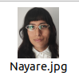
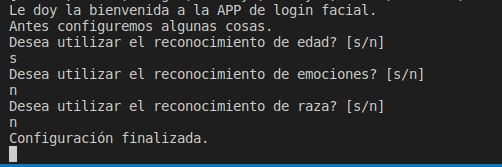

# Reconocimiento Facial con Visión Artificial
### ¿Para qué sirve esta APP?
Esta aplicación le permite detectar caras a través de la webcam de su equipo. Usted podrá elegir que personas reconocerá el programa como conocidas, a las cuales concederá acceso, y cuáles personas no será reconocidas, negándoles acceso. Además de reconocer las caras, indicará el nombre de la persona reconocida, un porcentaje de confianza (¿qué tan seguro está el algoritmo de que esté acertando?), y opcionalmente otros datos como edad aproximada, emoción predominante y raza.
## ***Instalación de librerías***
1. Clone este repositorio en la carpeta que desee.
2. Se aconseja crear un entorno destinado para este proyecto. Por ejemplo con conda o venv.
3. Abra la terminal y ejecute:
```
pip install -r requirements.txt
```
## ***Creación de ruta de carpetas***
1. Cree un archivo **.env** en la carpeta raíz.
2. En este archivo escriba: ruta = (ruta de carpetas hasta su carpeta raíz. Ejemplo.
```
ruta = /home/perseis/Factoriaf5/ejercicios
```
3. No indique el nombre de la carpeta ríz, solo la ruta hasta la carpeta anterior.
## ***¿Cómo arranco el programa?***
***Selección de personas reconocidas por la APP***
1. Cree una carpeta llamada faces/ dentro de la carpeta raíz Reconocimiento-Facial/.
2. En esta carpeta introduzca las imágenes de las personas que quiere que sean reconocidas por el programa (1 imagen por persona).
3. Se recomiendan los formatos .png o .jpg, y de calidad media.
4. Cambie el nombre de cada foto introducida por el nombre de la persona de la foto. 
* Ejemplo:

 

***Ejecución***

5. Abra una terminal dentro de la carpeta raíz (Reconocimiento-Facial)
6. Ejecute:
```
python main.py
```
7. El programa comenzará a funcionar. Dependiendo de la cantidad y calidad de las imágenes en faces/ y del rendimiento de su equipo **esto podría demorar bastante timpo**.
8. La configuración inicial comenzará. Le preguntará si quiere añadir una serie de análisis opcionales, por el momento, detección de edad, emociones y raza.



9. Responda en minúscula **s** si quiere utilizar ese análisis y **n** si no quiere usarlo.
10. Tras responder las 3 preguntas se abrirá la cámara, y comenzará el reconocimiento facial.


11. Ya puede usar la APP y ver el nombre de la persona reconocida, el porcentaje de confiablidad, si se le garantiza el acceso, y los resultados de los análisis opcionales.
12. **Para finalizar la APP** y cerrar la cámara pulse la tecla **Q** en su teclado.
## ***Imágenes de login guardadas***
Tras ejecutar con éxito la APP, se crearán 3 carpetas nuevas. Dentro de estas carpetas a su vez se creará una carpeta por persona en la carpeta faces/ con su respectivo nombre:
```
imagenes/ ----------- Fotograma entero de la persona reconocida cada minuto.
boxes/ -------------- Fotograma entero con etiquetas y box de la persona reconocida cada minuto.
rostros/ ------------ Rostro recortado de la persona reconocida cada segundo.
```
### Metodologías utilizadas:
- SCRUM (Metodología ágil) para la realización del proyecto.
- Pair programing para la creación de código.
### Tecnologías utilizadas:
- Trello para hacer el [seguimiento](https://trello.com/invite/b/yeRtRZHY/ATTId144e988afd674adbb5a2bb2bdb900b43E4F840C/cvgrupo11)
- Canva para realizar la presentación del proyecto.
- Python como lenguaje de programación.
### Librerías utilizadas más importantes:
- [face_recognition](https://github.com/ageitgey/face_recognition)
- [cv2](https://opencv.org/)
- [deepface](https://github.com/serengil/deepface)
### Créditos
Código basado en la idea de [Idently](https://www.youtube.com/watch?v=tl2eEBFEHqM&t=19s&ab_channel=Indently)

**Coders:**
- [Pablo Ruano](https://www.linkedin.com/in/pablo-ruano-sainz/)
- [Nayare Montes](https://www.linkedin.com/in/nayare-montes-gavilan/)
